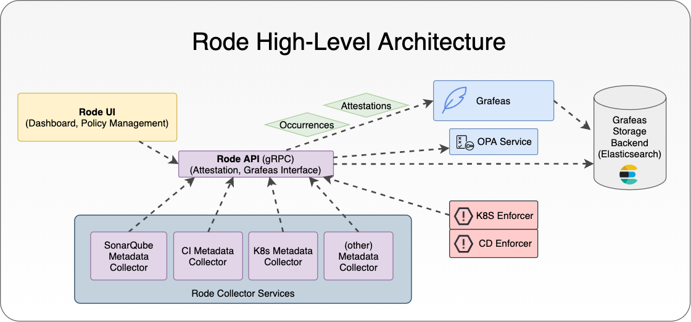

# rode
`rode` is a system of services built to enable Enterprise Automated Governance via Policy as Code
## rode API
This repository hosts the `rode api` Golang service

## Automated Governance
### Why Automated Governance?
* In search of truthful data:
  * As governance requires reliable information, we require a system that supports the collection of information that is validated and consistent
* Enterprises require a secure and reliable software delivery lifecycle to meet the needs of Audit and Compliance 
  * Systems have more dependencies and complexity than ever before; knowing for certain what you are running is a challenge
    * Hundreds and thousands of services/microservices need to be released by more and more development teams every day
    * The number of underlying dependencies and frameworks used to accelerate delivery adds to the increasing complexity of our systems
  * Change Control Boards (CCB/CAB) can’t move at the speed of Cloud-Native delivery
    * The amount of change that needs to be validated in cloud-native delivery requires an updated approach to governance
    * The policy evaluated by CAB should be documented well enough that we can automate a large portion of the validation process
  * Teams need feedback early and often with detail that informs them of what remains or what is required to produce a releasable artifact
    * As solutions are developed, the visibility into governance requirements should be transparent and provide detail to assist the teams in meeting policy
    * Policy should be supportive of, not a hindrance to delivery

## rode High-Level Architecture

## rode API Architcture
### TODO

## Development in rode
* [Development](docs/development.md)
