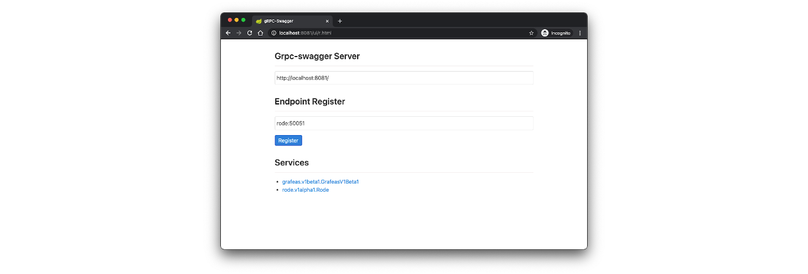

# Development

Use [Skaffold](https://skaffold.dev/) and Docker for Desktop to build and test Rode locally. Make sure your kubectl context is `docker-desktop` and Skaffold will use the local Skaffold profile deploy Rode, its dependencies and debug tools to the local cluster.

Skaffold will install the [Rode Helm chart](https://github.com/rode/charts/tree/main/charts/rode) which deploys Rode, Grafeas, Elasticsearch and OPA into the cluster.

Add Helm repositories
```sh
helm repo add rode https://rode.github.io/charts
helm repo add elastic https://helm.elastic.co
helm repo update 
```

Run Rode
```sh
skaffold dev --port-forward
```

## gRPC Swagger

[gRPC-Swagger](https://github.com/grpc-swagger/grpc-swagger) is a gRPC debugging tool which can inspect a running gRPC service, document the exposed API, send requests to the API endpoints and display the responses.

It is deployed to the local dev environment as part of the Skaffold local profile. Once the local deployment finish it can be accessed via http://localhost:8081.

Enter the grpc-swagger service URL (`http://localhost:8081/`) and the gRPC service host / port (`rode:50051`) and press the *Register* button to inspect the gRPC server and list available services.


